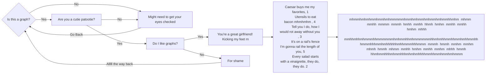

# Dearest Morgan
Hiiiiiii
## I hope you find this readme
I'm gonna hug you ***a lot***

```mermaid
graph LR 
    A{Is this a graph?} -- Yes --> B[Are you a cutie patootie?]
    A -- No --> C[Might need to get your eyes checked]
    B -- No --> C
    C -- Go Back --> A
    B -- Yes --> D[Do I like graphs?]
    D -- Yes --> E[You're a great girlfriend! Kicking my feet rn]
    D -- No --> F[For shame]
    F -- Alllll the way back --> A
    E --> G[Caesar buys me my favorites, 1
            Utensils to eat bacon mhmhmhm , 4 
            Tell you I do, how I would rot away without you , 3 
            It's on a rail's fence I'm gonna rail the length of you, 5
            Every salad starts with a vinaigrette, they do, they do. 2 
            ]
    G --> H[mhmmhmhmhmmhmmhmhmmmmmhmmhmhmmhmhmmhmhmmhhmhm  mhmm  
            mmhh  mmmm  mmmh  hmhh  mmhh  hhmh  hmhm  mmhh  mmhh
            hmhm  mhhh
            mmhhmhhmhmmmhhmmmmmmhmhmmhhmhmmmmmmhhmhmhhmmhhmmhmhhmmhh
            hmmmhhhmmhmhhhhhhmhhmmmhhhmmm  mmmh  hmmh  mmhm  mmhm
            mhmh  hmmh  mhmm  mmhh  hmhm  mmhh  mmhm  mhhh  hmmh 
            hhmhmmhhhmhmmhhhmhmhmhhhhmmhhmmhmmhmhmmm
            ]
``` 